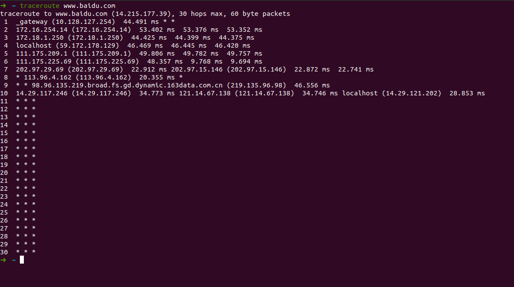

   

<h1 align="center">武汉大学国际软件学院<h1>

  

<h1 align="center">实验报告<h1>

  

<h2 align="center">课程名称：计算机网络</h2>

<h2 align="center">专业：软件工程</h2>

<h2 align="center">姓名：黄宣祺</h2>

<h2 align="center">学号：2020302111232</h2>

---

【实验项目名称】

计算机网络介绍

 

【实验目的】

学习ping, traceroute，git命令

 

【实验环境】

Ubuntu 20.04.03 LTS

 

【实验内容】

1 ping另外一台计算机

Linux ping 命令用于检测主机。

执行 ping 指令会使用 ICMP 传输协议，发出要求回应的信息，若远端主机的网络功能没有问题，就会回应该信息，因而得知该主机运作正常。

常用ping命令

（1）ping 127.0.0.1 

127.0.0.1是本地的回环地址，检测TCP/IP协议栈是否正常

（2）ping 本地ip 172.23.0.1

检查网卡是否工作正常

查看本地ip的命令——ifconfig -a

（3）ping 网关地址 10.128.127.254

检查和网关的连接性

查看网关的命令——ip route show

(4) ping 远程网站 www.baidu.com

检查远程连接

 

2 traceroute一台服务器

在Ubuntu下命令为traceroute

traceroute命令用于追踪数据包在网络上的传输时的全部路径，它默认发送的数据包大小是40字节。通过traceroute我们可以知道信息从你的计算机到互联网另一端的主机是走的什么路径。traceroute通过发送小的数据包到目的设备直到其返回，来测量其需要多长时间。

记录按序列号从1开始，每个纪录就是一跳 ，每跳表示一个网关，我们看到每行有三个时间，单位是 ms，其实就是-q的默认参数。探测数据包向每个网关发送三个数据包后，网关响应后返回的时间；如果您用 traceroute -q 4 www.58.com ，表示向每个网关发送4个数据包。

有时我们traceroute 一台主机时，会看到有一些行是以星号表示的。出现这样的情况，可能是防火墙封掉了ICMP的返回信息，所以我们得不到什么相关的数据包返回数据。

有时我们在某一网关处延时比较长，有可能是某台网关比较阻塞，也可能是物理设备本身的原因。

 

3 用git上传项目

3.1 设置SSH Key

3.1.1 首先我们在用户主目录下看是否存在.ssh目录，查看是否存在`id_rsa`与`id_rsa.pub`两个文件是否存在，

如果不存在，便打开终端，输入自己的邮箱地址，创建SSH Key

> ssh-keygen -t rsa -C "youremail@example.com"

会生成`/home/grq/.ssh`文件夹，里面也会生成文件`id_rsa`与`id_rsa.pub`，它们是SSH Key的秘钥对。其中`id_rsa`是私钥，不能泄露，`id_rsa.pub`是公钥，可以告诉其他人。

3.1.2 在GitHub端设置SSH Key

登录GitHub，点击右上角头像，Settings -> Personal settings -> SSH and GPG keys。在SSH Keys标签右方点击New SSH Key。
弹出两个文本框。其中的Title，可以随意命名。笔者此处随便命名为grq-Ubuntu。
另一个Key文本框，需要输入刚刚生成的id_rsa.pub文件中的内容。粘贴后点击Add SSH Key，即可生成SSH Key。

3.2 上传项目

git分为四部分：

一部分是自己的本机文件，一部分是缓存区，一个是本地仓库，一个是服务器仓库。当用户在本机修改了文件后，就应该使用git add xx指令将修改保存到缓存区，然后再用git commit yy指令将推送从缓存区修改到本地仓库中，最后使用git push将本地仓库中的修改推送到服务器仓库中。

> git init # 这个命令可以把当前目录变成git可以管理的仓库。
>
> git add file # 添加需要上传的文件
>
> #git init # 检查当前git状态
>
> git commit -m "xxx" # 将缓存区的修改提交到本地仓库

如果出现

> fatal: unable to auto-detect email address (got 'XXX@YYY.(none)')

这时候的解决办法是，在进行`git add ./`操作的路径中，实际上已经生成了一个隐藏的.git文件夹。在该路径下输入指令`cd ./.git`便进入.git文件夹，使用gedit或vim打开文件config，在文件末尾加入内容：

> [user] 
>
> ​	email = your email 
>
> ​	name = your name

再返回上层目录，进行commit命令，即可成功

> git remote add origin git@github.com:xxx

如果此时出现错误：fatal: remote origin already exists. 这时候说明远程仓库已经存在。这时候需要先删除origin仓库，然后再重新添加该远程仓库。指令如下：

git remote rm origin
git remote add origin git@github.com:upcAutoLang/Framework-for-NACIT2017.git

> git push origin master

 

【结论】

通过这两个小实验，学习了Ubuntu中跟计算机网络密切相关的两个命令：ping, traceroute, 以及git命令，提高了对计算机网络的兴趣。计算机光听理论是学不懂的，以后还需要课下多多实践。
