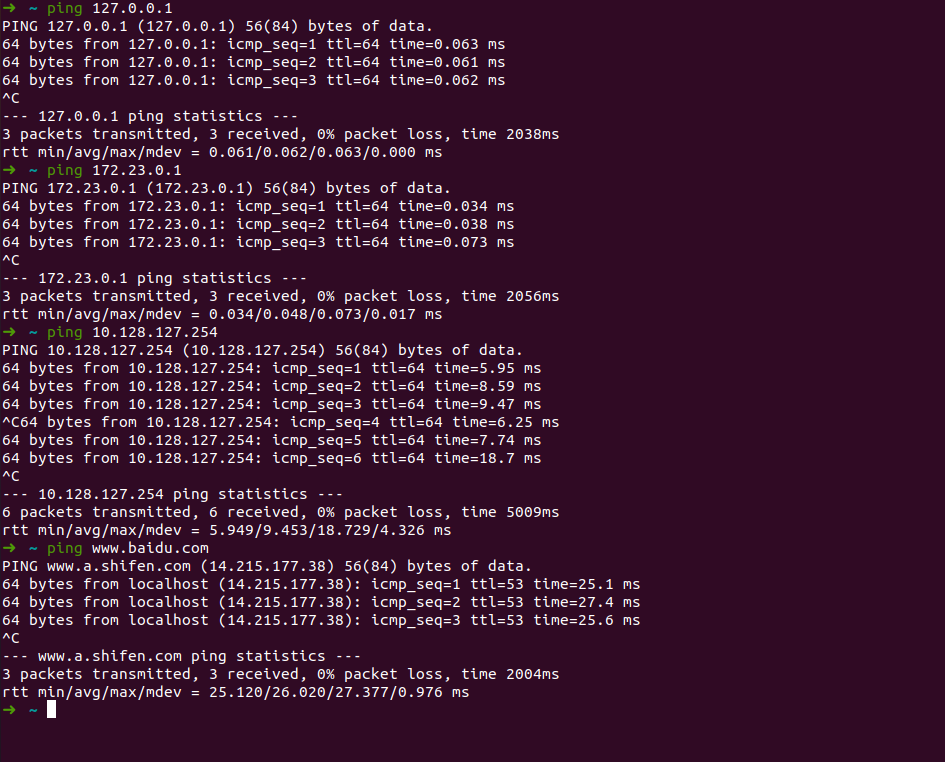
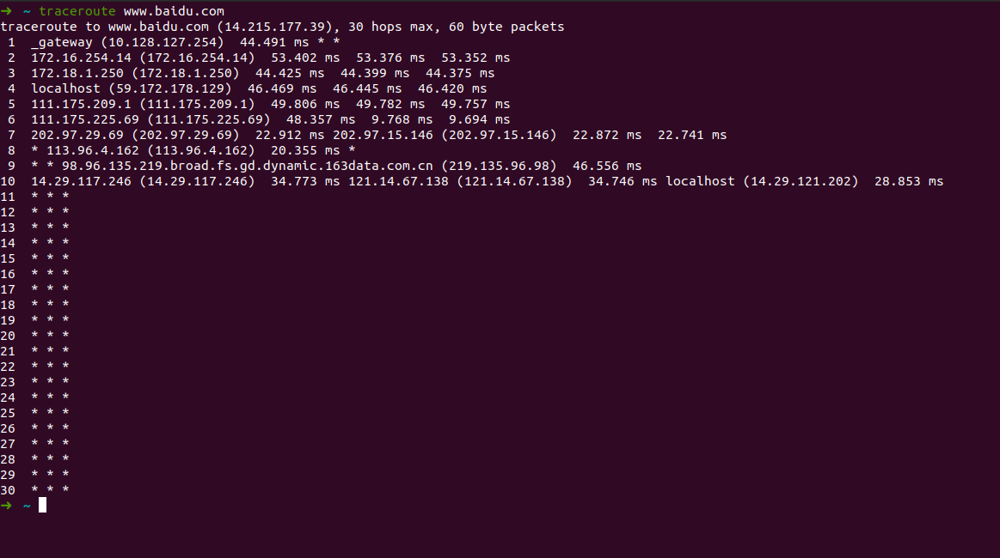

# 武汉大学国际软件学院实验报告

**姓名：黄宣祺**

**学号：2020302111232**

【实验环境】

Ubuntu 20.04.03 LTS

【实验内容】

1 ping另外一台计算机

Linux ping 命令用于检测主机。

执行 ping 指令会使用 ICMP 传输协议，发出要求回应的信息，若远端主机的网络功能没有问题，就会回应该信息，因而得知该主机运作正常。

常用ping命令

（1）ping 127.0.0.1 

127.0.0.1是本地的回环地址，检测TCP/IP协议栈是否正常

（2）ping 本地ip 172.23.0.1

检查网卡是否工作正常

查看本地ip的命令——ifconfig -a

（3）ping 网关地址 10.128.127.254

检查和网关的连接性

查看网关的命令——ip route show

(4) ping 远程网站 www.baidu.com

检查远程连接

2 tracert一台服务器

在Ubuntu下命令为traceroute

traceroute命令用于追踪数据包在网络上的传输时的全部路径，它默认发送的数据包大小是40字节。通过traceroute我们可以知道信息从你的计算机到互联网另一端的主机是走的什么路径。traceroute通过发送小的数据包到目的设备直到其返回，来测量其需要多长时间。

记录按序列号从1开始，每个纪录就是一跳 ，每跳表示一个网关，我们看到每行有三个时间，单位是 ms，其实就是-q的默认参数。探测数据包向每个网关发送三个数据包后，网关响应后返回的时间；如果您用 traceroute -q 4 www.58.com ，表示向每个网关发送4个数据包。

有时我们traceroute 一台主机时，会看到有一些行是以星号表示的。出现这样的情况，可能是防火墙封掉了ICMP的返回信息，所以我们得不到什么相关的数据包返回数据。

有时我们在某一网关处延时比较长，有可能是某台网关比较阻塞，也可能是物理设备本身的原因。

【结论】

通过这两个小实验，学习了Ubuntu中跟计算机网络密切相关的两个命令，提高了对计算机网络的兴趣。计算机光听理论是学不懂的，以后还需要课下多多实践。
